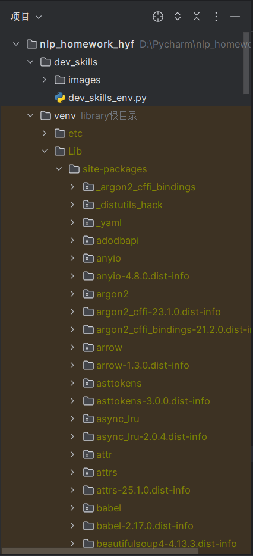

# 蛮吉的自我介绍


大家好，我是**蛮吉**，我的身份是*神圣兽国游尾郡窝窝乡独行族妖侠*。以下是我的自我介绍：

---

## 基础档案 

### 外貌特征 
- 红色的头发
- 橙色长袖外衣 + 黄色包裹

### 我的朋友
1. 蛮小满
2. 镜心
3. 海问香
### 和朋友们的合照


### 重要坐标
- 🏠 **住址**: [神圣兽国游尾郡窝窝乡](https://baike.baidu.com/item/%E6%AF%94%E5%A5%87%E5%A0%A1/8275168) 
- 🏢 **工作单位**: [蟹堡王餐厅](https://baike.baidu.com/item/%E8%9F%B9%E5%A0%A1%E7%8E%8B/8043124)

### 日常作息表
| 时间       | 事项        |
|------------|-----------|
| 6:00 AM    | 起床挑战窝窝乡村长 |
| 10:00 AM   | 复盘失败经验    |
| 3:00 PM    | 练习脉术      |
| 11:00 PM   | 数星星睡觉     |

### 人生信条
> "要成为最伟大的妖侠"
---

## 我的专业是人工智能（无人系统机器人）
### 我最喜欢的一段代码

```python
#!/usr/bin/env python3
print("Hello, World!")
```
其中执行`print("Hello, World!")`可输出结果。

### 我最喜欢的环境管理工具是venv


### 我可以在IDE上使用我建立的虚拟环境
