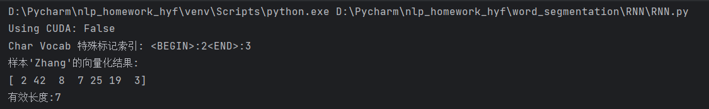
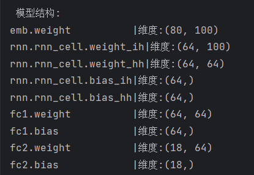
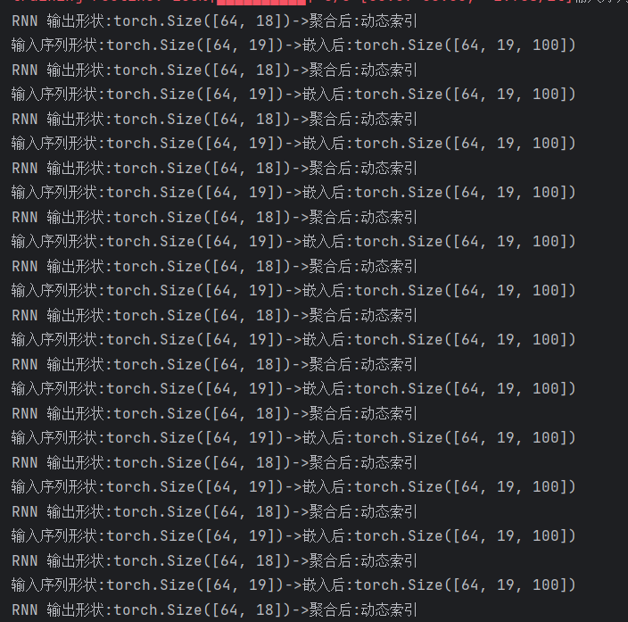
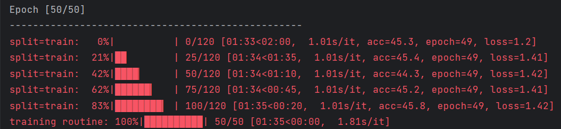
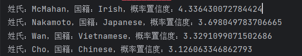
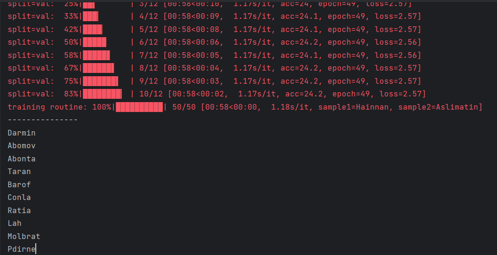
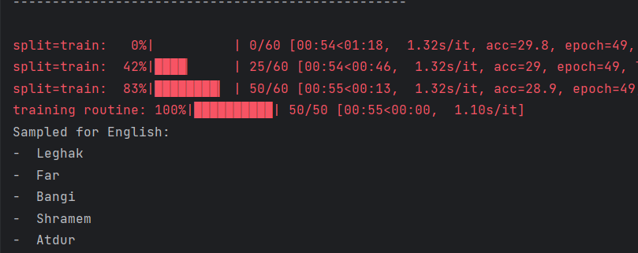

# 数据预处理验证

# 模型结构验证

# RNN序列处理验证

# 50轮损失值

# 推理结果

# 无条件生成姓氏

# 有条件生成姓氏

# 问题答案
1、两个模型的核心差异体现在什么机制上？（ B ）\
A. 字符编码方式不同\
B. 是否考虑国家信息作为生成条件\
C. RNN单元类型不同（GRU/LSTM）\
D. 损失函数计算方式不同

2、在条件生成模型（Model2_Conditioned_Surname_Generation）中，国家信息通过什么方式影响生成过程？（ B ）\
A. 作为额外的输入特征拼接\
B. 作为GRU的初始隐藏状态\
C. 作为注意力机制的key\
D. 作为输出层的偏置项

3、文件2中新增的nation_emb层的主要作用是：（ B ）\
self.nation_emb = nn.Embedding(num_nationalities, rnn_hidden_size)\
A. 将字符索引映射为稠密向量\
B. 将国家标签转换为隐藏状态初始化向量\
C. 生成姓氏的长度控制参数\
D. 计算交叉熵损失的辅助参数

4、对比两个文件的sample_from_model函数，文件2新增了哪个关键参数？（ B ）\
A. temperature\
B. nationalities\
C. device\
D. max_length